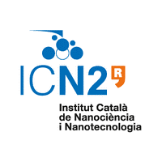

# Chemical synthesis of plasmonic metal nanoparticles and their characterization

[About the project](./readme.md)

[O projektu (HR)](./hrabout.md)

[Contact](./contact.md)

## Welcome to the webpage of the project "Chemical synthesis of plasmonic metal nanoparticles and their characterization".

### Info about the project:

- project duration: 1st of July to 31t of November 2019 (5 months)
- value of project: 59,000.00 HRK
- people involved:  
[Ivana Fabijanić](https://www.irb.hr/eng/About-RBI/People/Ivana-Fabijanic) from [Ruđer Bošković Institute](https://www.irb.hr/eng) (project leader),  
[dr.sc. Neus Gomez Bastús](https://icn2.cat/en/staff-directory?member=186) from [Institut Català de Nanociència i Nanotecnologia](https://icn2.cat/en/about-icn2) (project co-leader),
[dr.sc. Vesna Janicki](https://www.irb.hr/eng/About-RBI/People/Vesna-Janicki) from [Ruđer Bošković Institute](https://www.irb.hr/eng),
[dr.sc. Jordi Sancho Parramon](https://www.irb.hr/eng/About-RBI/People/Jordi-Sancho-Parramon) from [Ruđer Bošković Institute](https://www.irb.hr/eng),
[prof. dr. sc. Jordi Arbiol](https://icn2.cat/en/advanced-electron-nanoscopy-group/jordi-arbiol) from [Institut Català de Nanociència i Nanotecnologia](https://icn2.cat/en/about-icn2),
[dr. sc. Javier Patarroyo](https://icn2.cat/en/staff-directory?member=991) from [Institut Català de Nanociència i Nanotecnologia](https://icn2.cat/en/about-icn2) 

 

#### The project is funded by the [Unity Through Knowledge Fund](http://ukf.hr/default.aspx?id=26).

  

Ruđer Bošković Institute is the beneficiary.

Institut Català de Nanociència i Nanotecnologia is the host institution where the project leader will work under the mentorship of the project co-leader to gain new skills and knowledge needed for the successful work on the project.

### Project summary
The proposed project “Chemical synthesis of plasmonic metal nanoparticles and their characterization” has several objectives. One of them is finding out the synthesis conditions for obtaining homogenous, stable, shape-controlled noble metal (silver, gold, platinum) nanoparticles solutions with narrow size distribution. The important factor is to determine the relevant parameters for obtaining targeted properties and establishing a reproducible synthesis routine with a special interest in the preparation of hollow metal nanoparticles. The second objective is to learn about the available methods of characterization of noble metal nanoparticles, including the interpretation of the obtained results and the acquisition (at least partially) of routine in the analysis. The third objective is to strengthen the collaboration between groups, defining a common area of interest and using complementary know-how and facilities. The know-how of EFAD method will be transferred to the Catalan Institute of Nanoscience and Nanotechnology and the knowledge of chemical synthesis of noble metal nanoparticles solution will be transferred to the Ruđer Bošković Institute (IRB). With the acquired “know-how” it will be possible to prepare noble metal nanoparticles solutions on demand at the IRB, which is especially important in the case when nanoparticles tend to agglomerate in a relatively short time. Prepared solutions of nanoparticles will be used for micro- and nano-structuring for different purposes (sensors, waveguides, microelectronics, optical chips). The experience acquired from the group of the Catalan Institute of Nanoscience and Nanotechnology will be expanded at IRB, increasing competitiveness in the scientific activities, enabling better chances of obtaining financing for new interesting projects in the future. Since there is a demand for noble metal nanoparticles solutions, there is a possibility of commercialization, i.e. offering nanoparticles synthesis service for interested laboratories, faculties and institutes in the Republic of Croatia, broadening the collaboration and commercialization potential of the IRB group.
