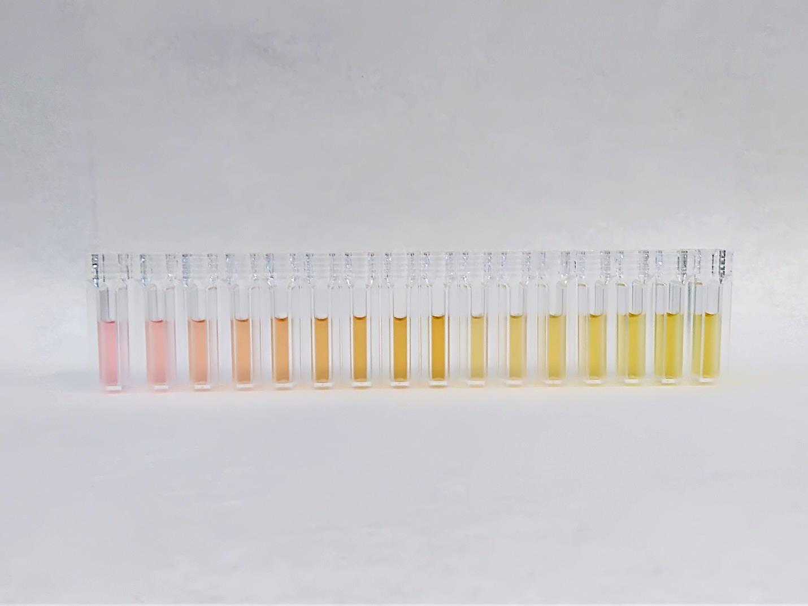
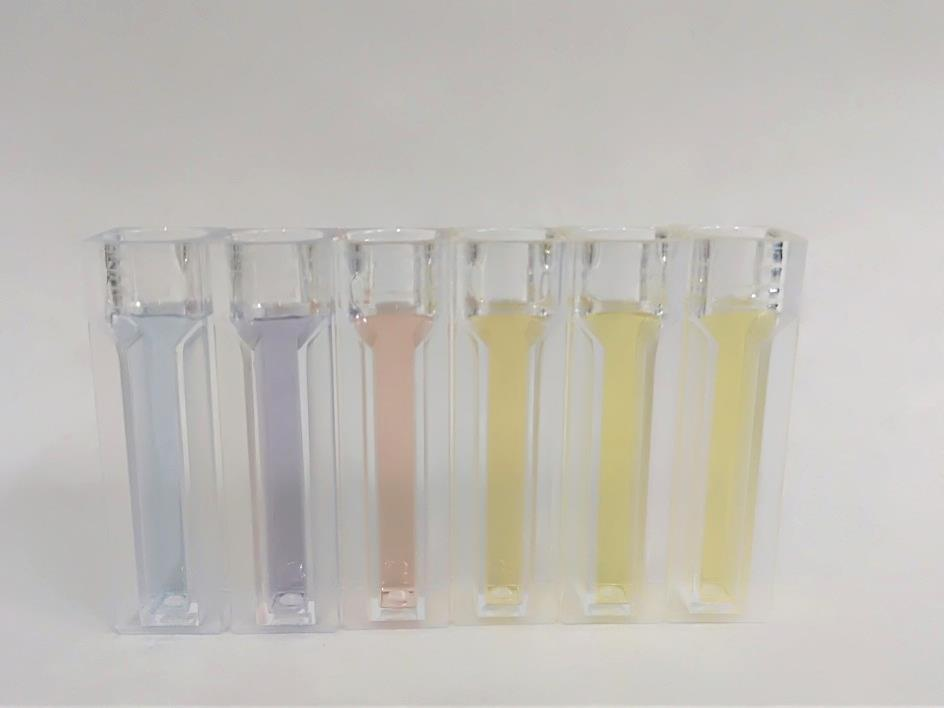
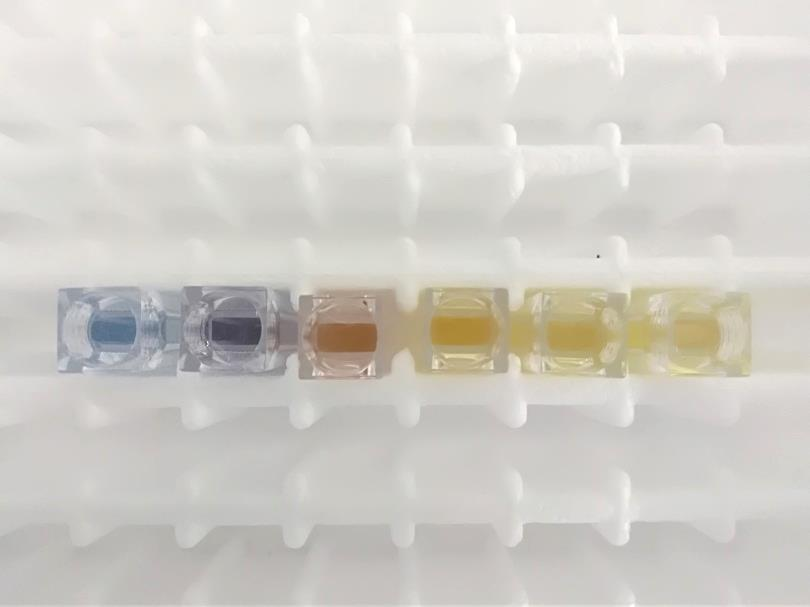
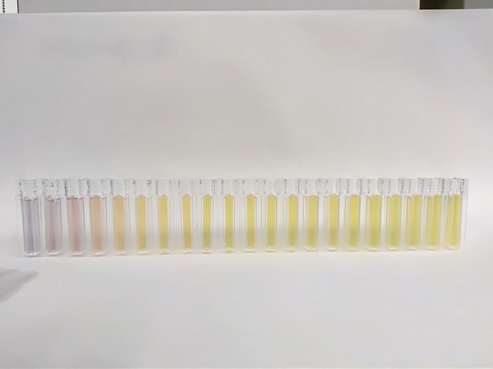

# Chemical synthesis of plasmonic metal nanoparticles and their characterization

[About the project](./readme.md)

[O projektu (HR)](./hrabout.md)

[Contact](./contact.md)

[Results](./results.md)

# Results

The proposed project “Chemical synthesis of plasmonic metal nanoparticles and their characterization” had several objectives. One of them was finding out the synthesis conditions for obtaining homogenous, stable, shape-controlled noble metal (silver, gold, platinum) nanoparticles solutions with narrow size distribution. The important factor was to determine the relevant parameters for obtaining targeted properties and establishing a reproducible synthesis routine with a special interest in the preparation of hollow metal nanoparticles. The second objective was to learn about the available methods of characterization of noble metal nanoparticles, including the interpretation of the obtained results and the acquisition  of routine in the analysis. The third objective was to strengthen the collaboration between groups, defining a common area of interest and using complementary know-how and facilities. The know-how of EFAD method was transferred to the Catalan Institute of Nanoscience and Nanotechnology and the knowledge of chemical synthesis of noble metal nanoparticles solution are to be transferred to the Ruđer Bošković Institute (IRB). With the acquired “know-how” it will be possible to prepare noble metal nanoparticles solutions on demand at the RBI. 

Various plasmonic nanoparticles solutions. Color depends on the size, shape and type of plasmonic material, as well as the concentration of nanoparticless.

  

  

  

  

Scanning electron microscope photographs of some nanoparticles:

Gold nanoparticles
 

Silver nanoparticles
 

Hollow gold nanoparticles
 

